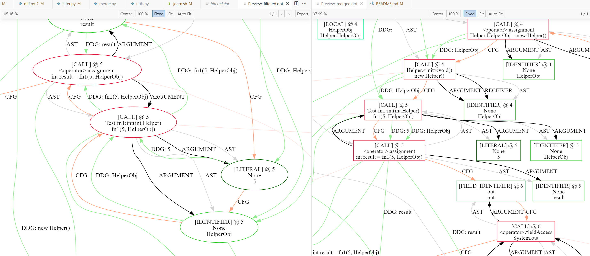

# Universal Code Property Graph

## 介绍

Code Property Graph（CPG）最早由 Yamaguchi 等人在 2014 年提出，将 AST、CFG 和 DDG 融合为统一的图结构，并在 Joern 项目中实现并开源[^1]。目前 Joern 的 CPG 规范已迭代至 1.1 版本[^2]，并扩展了大量图属性。本项目旨在基于 Joern，为 Java 和 Python 代码生成文件级别的 CPG，包含 AST、CFG、DDG、调用图（Call Graph）和类型图（Type Graph）。

### Filter和Merge差异说明

差别1：filter 出来的 CFG 要经过所有节点，merge 出来的 CFG 只经过语句节点。

差别2：filter 出来的 DDG 也是所有节点都有（从 argument 到 call），merge 出来的 DDG 只经过语句节点。

filter 出来的整体更细致、精度更高、更符合底层逻辑；merge 出来的 CFG、PDG 只出现在 AST 的高级节点中，不考虑子节点。

---

[^1]: Yamaguchi, Fabian, et al. "Modeling and discovering vulnerabilities with code property graphs." 2014 IEEE symposium on security and privacy. IEEE, 2014. [Joern 项目地址](https://github.com/joernio/joern)
[^2]: [Joern CPG 规范 1.1](https://cpg.joern.io/)