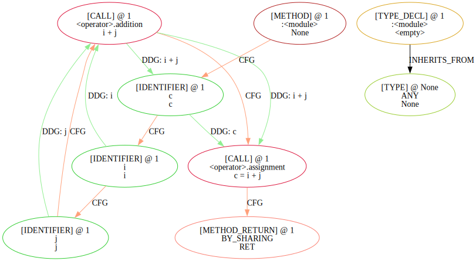
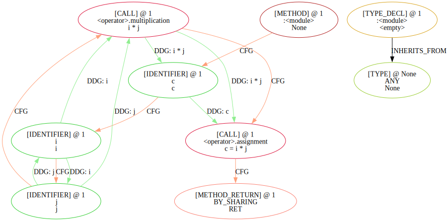
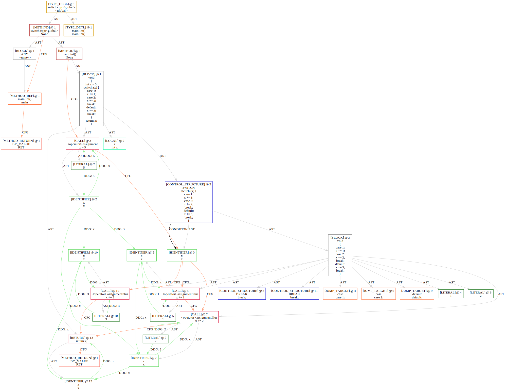

# 高等语言生成：Joern

## 介绍

Code Property Graph（CPG）最早由 Yamaguchi 等人在 2014 年提出，将 AST、CFG 和 DDG 融合为统一的图结构，并在 Joern 项目中实现并开源[^1]。目前 Joern 的 CPG 规范已迭代至 1.1 版本[^2]，并扩展了大量图属性。本项目旨在基于 Joern，为 Java 和 Python 代码生成文件级别的 CPG，包含 AST、CFG、DDG、调用图（Call Graph）和类型图（Type Graph）。

## 缺陷

因为 Joern 并非基于　IR　或字节码进行程序分析，而是直接基于源代码，因此 joern 存在诸多缺陷和兼容性问题，目前已经发现的包括：

- 有限的指针支持（C/C++）
- CallGraph中无法找到继承类的函数体
- operator overload 无法识别
- 错误的DFG
- 函数调用时，缺少`caller->callee`的argument的data flow，以及`callee->caller`的return的data flow [参考](https://groups.seas.harvard.edu/courses/cs252/2011sp/slides/Lec05-Interprocedural.pdf)
- 无法提供分支条件

此外，编程语言的不同也会造成生成的CDFG不同。

### 错误的DFG

Joern在处理四则运算时，除了加法外，DFG都会出现多余的边。这个问题至少在C/C++和Python上存在：

```py
c = i + j
```

```py
c = i * j
```

上面两个Python代码生成的CDFG分别如下，注意代码左下角IDENTIFER节点i、j之间多了DDG边。




### 无法提供分支条件

Joern的AST节点`CONTROL_STRUCTURE`可以标注分支类别，如`if`, `while`，但在分支节点上有多个 control flow 时，Joern不提供 control flow的条件。

例如对于代码 `if (x>0) x=1; else x=2;`, 会生成`call.greaterthan[x>0]`节点，分别通过control flow edge连接`call.assignment[x=1]`和`call.assignment[x=2]`，但是在什么情况下经过哪一条边没有说明。（这是最简单的情况，可以根据两个节点对应的代码位置推断出True/False）

对于`switch`语句，Joern不提供条件节点，如下图所示。



---

[^1]: Yamaguchi, Fabian, et al. "Modeling and discovering vulnerabilities with code property graphs." 2014 IEEE symposium on security and privacy. IEEE, 2014. [Joern 项目地址](https://github.com/joernio/joern)

[^2]: [Joern CPG 规范 1.1](https://cpg.joern.io/)