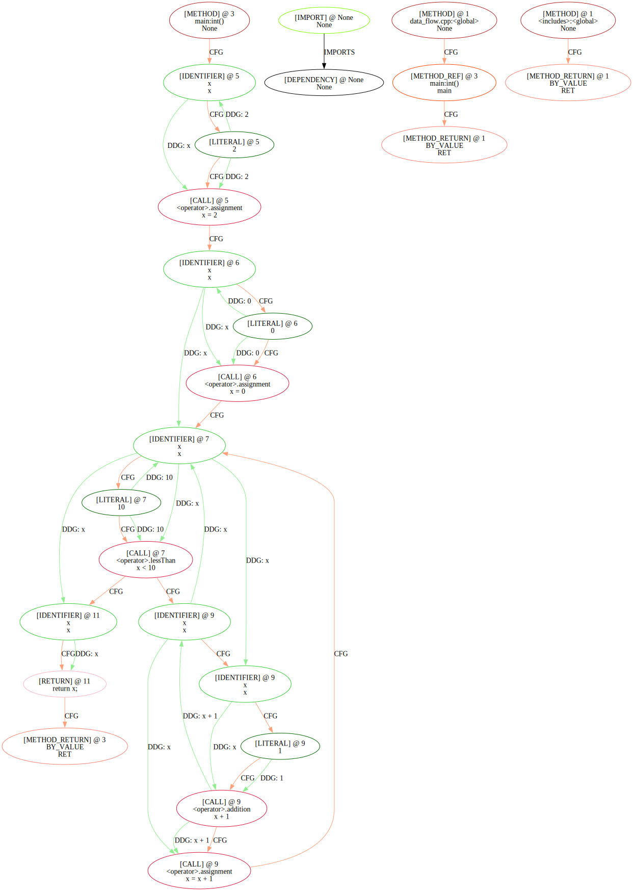
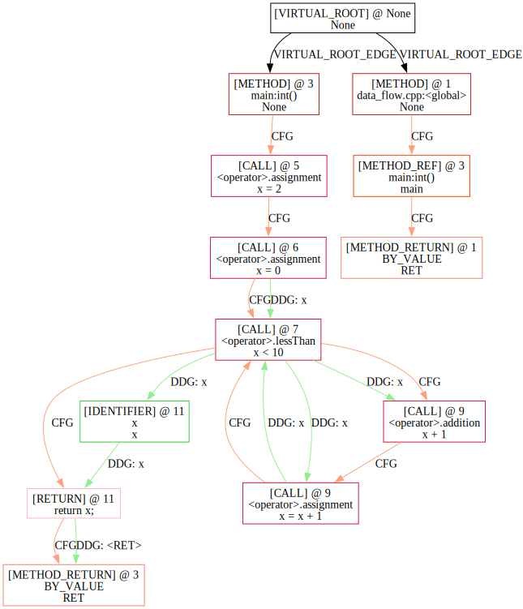

# 使用Joern提取CDFG

## 提取方法

Joern 支持两种图[导出](https://docs.joern.io/export/)形式：导出所有layer和导出指定layer。

由于我们只关心 AST、CFG、DFG、CallGraph，因此有两种可能的解决方案：

1. 导出所有Layer，删除不需要的Layer
2. 导出我们需要的Layer，后期合并图

在导出CFG和DFG中，这两种方法导出的图会不一致：

- 导出所有Layer：CFG和DFG会连接到AST的节点上（如连接在两个Literal节点上）
- 分别导出Layer：CFG和DFG只在statement level的节点上有连接。

下面是一个[例子](https://www.cs.cornell.edu/courses/cs4120/2023sp/notes.html?id=reachdef)。注意，在代码`int x = 2`处定义的`x`的数值实际上并未使用（**DEAD CODE**）：

```cpp
#include <stdio.h>

int main()
{
    int x = 2;
    x = 0;
    while (x < 10)
    {
        x = x + 1;
    }
    return x;
}
```

导出所有Layer生成的CDFG(`src/filter.py`)：



分别导出Layer生成的CDFG(`src/merge.py`)（可以看到，例如`x=2`的DFG已经彻底消失）：



这里，我认为一种比较好的形式是，CFG在statement level（尽可能简化图），DFG在 Literal/Identifier level（在Data flow上要足够精确，这和[Single static assignment form是一致的](https://se421-fall2018.github.io/resources/lectures/DataFlowGraphs.pdf#page=18.00)）。因此需要使用两种方法分别生成，分别提取CFG和DFG。

?> 这种形式和[Transformers Meet Directed Graphs](https://arxiv.org/abs/2302.00049)的方法是一致的，已经在`src/v2.py`中实现。

## 分支处理

在遇到`if`或`while`等关键字标志的分支语句时，Joern不会显式说明关键字（实际上在AST中会有关键字节点，但是不同的语言的AST有很大区别。例如在C/C++中，有if、else两个AST节点和分支block，但Python中只有一个if的AST节点），而是只在分支条件上出现多个CFG的出边。参考上图中的`[CALL @7] <operator>.lessThan x<10`：没有while关键字或者True/False判断。这回对表征学习造成显著的信息丢失：我们不知道两个分支对应的True/False。

参考[Transformers Meet Directed Graphs](https://arxiv.org/abs/2302.00049)，我们应当额外为分支添加True/False条件，因此至少应当有下面三种CFG Edge：

- CFG_NEXT
- CFG_TRUE
- CFG_FALSE

此外，还有其他类型分支，如switch / try-catch等

